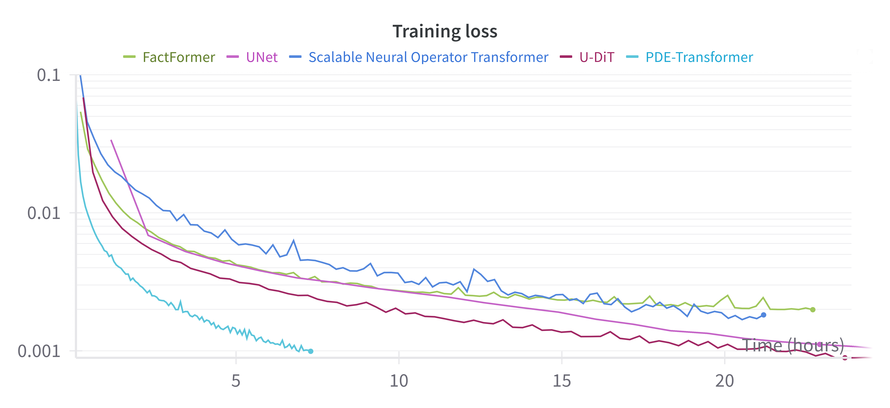

# PDE-Transformer

<div class="grid cards" markdown>

- :rocket: **Efficient Processing**
    
    Optimized attention mechanisms for physical simulations

- :dart: **High Accuracy**
    
    State-of-the-art results on various physics simulation tasks

- :arrows_counterclockwise: **Versatile**
    
    Works with different types of PDEs and physical systems

- :chart_with_upwards_trend: **Scalable**
    
    Handles both small and large-scale simulations effectively

</div>

## Abstract

We introduce PDE-Transformer, an improved transformer-based architecture for surrogate modeling of physics simulations on regular grids. We combine recent architectural improvements of diffusion transformers with adjustments specific for large-scale simulations to yield a more scalable and versatile general-purpose transformer architecture, which can be used as the backbone for building large-scale foundation models in physical sciences.

We demonstrate that our proposed architecture outperforms state-of-the-art transformer architectures for computer vision on a large dataset of 16 different types of PDEs. We propose to embed different physical channels individually as spatio-temporal tokens, which interact via channel-wise self-attention. This helps to maintain a consistent information density of tokens when learning multiple types of PDEs simultaneously.

Our pre-trained models achieve improved performance on several challenging downstream tasks compared to training from scratch and also beat other foundation model architectures for physics simulations.

## Paper

[PDE-Transformer: Efficient and Versatile Transformers for Physics Simulations](https://arxiv.org/abs/2505.24717)<br>
[Benjamin Holzschuh](https://www.linkedin.com/in/benjamin-holzschuh/), Qiang Liu, Georg Kohl, [Nils Thuerey](https://ge.in.tum.de/about/n-thuerey/)<br>
Technical University of Munich<br>
International Conference on Machine Learning (ICML) 2025

```bibtex
@article{holzschuh2025pde,
  author    = {Holzschuh, Benjamin and Liu, Qiang and Kohl, Georg and Thuerey, Nils},
  title     = {PDE-Transformer: Efficient and Versatile Transformers for Physics Simulations},
  booktitle = {Forty-second International Conference on Machine Learning, {ICML} 2025, Vancouver, Canada, July 13-19, 2025},
  year      = {2025}
}
```

## Results

### Performance Comparison

We compare PDE-Transformer to state-of-the-art transformer architectures for computer vision on our pretraining dataset of 16 different PDEs, in particular a modern [UNet](https://github.com/tqch/ddpm-torch) architecture and Diffusion transformers with token up- and downsampling [U-DiT](https://github.com/YuchuanTian/U-DiT). Additionally, we compare to scalable operator transformer [scOT](https://github.com/camlab-ethz/poseidon) and [FactFormer](https://github.com/BaratiLab/FactFormer), both transformer-based architecture for physics simulations. PDE-Transformer achieves superior performance while requiring less training time compared to other models.

<figure markdown>
  { width="600" }
  <figcaption>Training time comparison with state-of-the-art models on 4x H100 GPUs. PDE-Transformer achieves superior performance while requiring less training time compared to other models.</figcaption>
</figure>

| Architecture | Subquadratic Runtime | Non-square Domains | Periodic Boundaries | Advanced Conditioning |
|--------------|---------------------|-------------------|-------------------|---------------------|
| FactFormer | (✓) | ✗ | ✓ optional | ✗ |
| UNet | ✗ | ✓ | ✗ | ✓ |
| scOT | (✓) | ✗ | ✓ required | ✗ |
| U-DiT | ✗ | ✓ | ✗ | ✓ |
| **PDE-Transformer** | **✓** | **✓** | **✓ optional** | **✓** |

## Code

The implementation is available on GitHub: [tum-pbs/pde-transformer](https://github.com/tum-pbs/pde-transformer)

```bash
# Install via pip
pip install pdetransformer

# Install from source
git clone https://github.com/tum-pbs/pde-transformer
cd pde-transformer
pip install -e ".[dev]"
```

For detailed documentation, see our [Documentation](getting-started.md).


## Acknowledgments

This work was supported by the ERC Consolidator Grant
SpaTe (CoG-2019-863850). The authors gratefully acknowledge the scientific support and resources of the AI service
infrastructure LRZ AI Systems provided by the Leibniz Supercomputing Centre (LRZ) of the Bavarian Academy of
Sciences and Humanities (BAdW), funded by Bayerisches
Staatsministerium fur Wissenschaft und Kunst (StMWK).